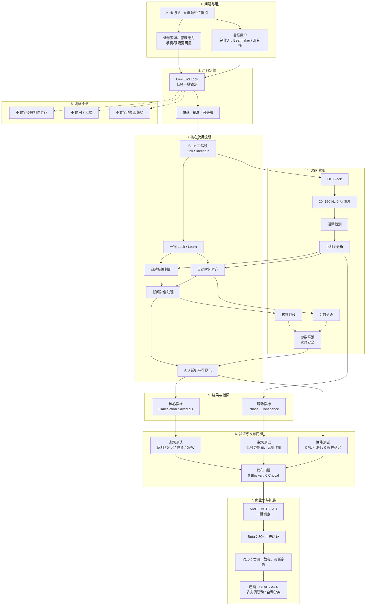

# Low-End Lock — 产品逻辑导图

> 本图用于从产品、技术、验证、商业化四个层面快速检查 Low-End Lock 的逻辑闭环。

## 阅读要点

1. **问题 → 定位**：低频相位抵消是明确痛点，产品因此必须保持“低频专用、一键修复”的定位。
2. **流程 → DSP**：用户只看到一个 Lock 按钮，但背后对应互相关、极性与分数延迟三条核心 DSP 路径。
3. **指标 → 验证**：`Cancelation Saved` 不是装饰，而是连接主观效果和客观测试的关键指标。
4. **验证 → 商业化**：MVP 先证明可用，Beta 再验证用户理解，V1.0 才进入正式售卖。
5. **非目标**：所有非目标都用于防止产品退化成“又一个全功能相位工具”。

